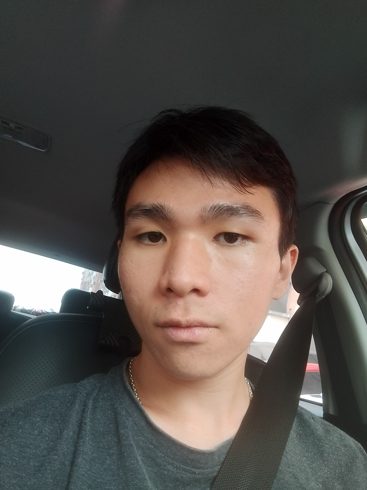

<h1>Simon Yung</h1>

<i>Aspiring Gameplay Programmer | Game Developer</i>

  <a href="#about">About</a> |
  <a href="#projects">Projects</a> |
  <a href="#skills">Skills</a> |
  <a href="#contact">Contact</a>

<h2 id="about">About Me</h2>

  Hello! I am a Game Development student with an interest in gameplay
  programming and creating interactive game systems.

  I enjoy developing games and learning more about gameplay programming,
  Unity, C++, and game development. This website showcases the projects
  I have worked on and my journey as a game developer.

 

---

## 🎮 Projects {#projects}

### 1. [Swiss or Miss](swiss-or-miss.html)

**Swiss or Miss** is a single-player roguelike game where players take the role of a graphic designer and create posters based on different client requirements. Players must balance creativity and strategy while managing their resources, stress, and deadlines.

- **Engine:** Unity
- **Project:** Game Project Studio 1 - Team Project
- **Role:** Gameplay Programmer
- [🎮 Play on itch.io](https://uowmgames.itch.io/swiss-or-miss) 
- [📖 More Info](swiss-or-miss.html)

---

### 2. [Meteor Pong](meteor-pong.html)
- **Engine:** Stencyl  
- **Role:** Gameplay Programmer  
- [🎮 Play on itch.io](https://your-game-link.com) (coming soon)  

---

### 3. [Virus Exterminator](virus-exterminator.html)
- **Engine:** Stencyl  
- **Role:** Gameplay Programmer  
- [🎮 Play on itch.io](https://your-game-link.com) (coming soon)  

---

### 4. [Bomb Guy](bomb-guy.html)
- **Engine:** Stencyl  
- **Role:** Gameplay Programmer  
- [🎮 Play on itch.io](https://your-game-link.com) (coming soon)  

---

## 🛠 Skills {#skills}
- Stencyl
- Photoshop
- Aseprite  
- Unity

---

## 📫 Contact {#contact}

---

© 2025 Simon Yung. All rights reserved.
